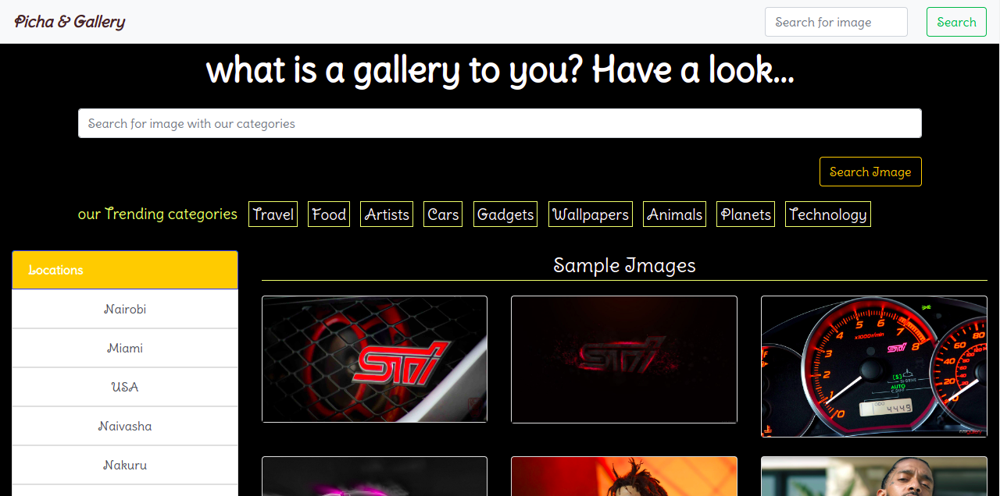

#  Gallery


#### By Adrian Baaru

## Table of Content

+ [Description](#description)
+ [Installation Requirement](#installation-requirements)
+ [Technology Used](#technologies-used)
+ [License](#license)
+ [Authors Info](#authors-info)

## Description
Personal gallery application that you display your photos for others to see.


[Go Back to the top](#gallery)


## User Stories

User Can :-

* View different photos that interest me.
* Click on a single photo to expand it and also view the details of the photo. The photo details must appear on a modal within the same route as the main page.
* Search for different categories of photos. (ie. Travel, Food)
* Copy a link to the photo to share with my friends.
* View photos based on the location they were taken.

[Go Back to the top](#gallery)

Home module



Search module with search term


## Behaviour Driven Development
| Behaviour | Input | Output |
| :---------------- | :---------------: | ------------------: |
| Application starts | **On page load** | see a search bar and some sample images |
| Search| **image category** | Redirects to search results page and if image exists the images shown else otherwise |
| Image click | **Image click** | Modal appears with the image details and description|
| click on copy image link | **Button click** | Copies image link that can be shared with others|
| Close button | **button click** | Closes modal and redirects to home page|


## Installation Requirements

### Prerequisites

- Django
- Pip & Python
- Pillow 
- Postgres Database

## Instructions

To use this gallery project .......  
  
##### Clone Repository:  
 ```bash 

```
##### Install and activate Virtual Environment virtual  
 ```bash 
cd tribune && python3 -m venv virtual && source virtual/bin/activate 
```  
##### Install Dependencies  
 ```bash 
 pip install -r requirements.txt 
```  
##### Setup Database  
  SetUp Database User,Password, Host then following Command  
 ```bash 
python manage.py makemigrations news 
 ``` 
 Now Migrate  
 ```bash 
 python manage.py migrate 
```
##### Run Application  
 ```bash 
 python3 manage.py runserver 
 or
 ./manage.py runserver
```
##### Test Application  
 ```bash 
 python manage.py test news
```
Open the application on your browser `127.0.0.1:8000`.  

[Go Back to the top](#gallery)


## Technologies Used


## License
[](https://opensource.org/licenses/MIT)

[MIT License](LICENSE)


## Live Site

#### https://gal-lery.herokuapp.com/


<p align = "center">
    &copy; 2022 @Adrian Baaru.
</p>
